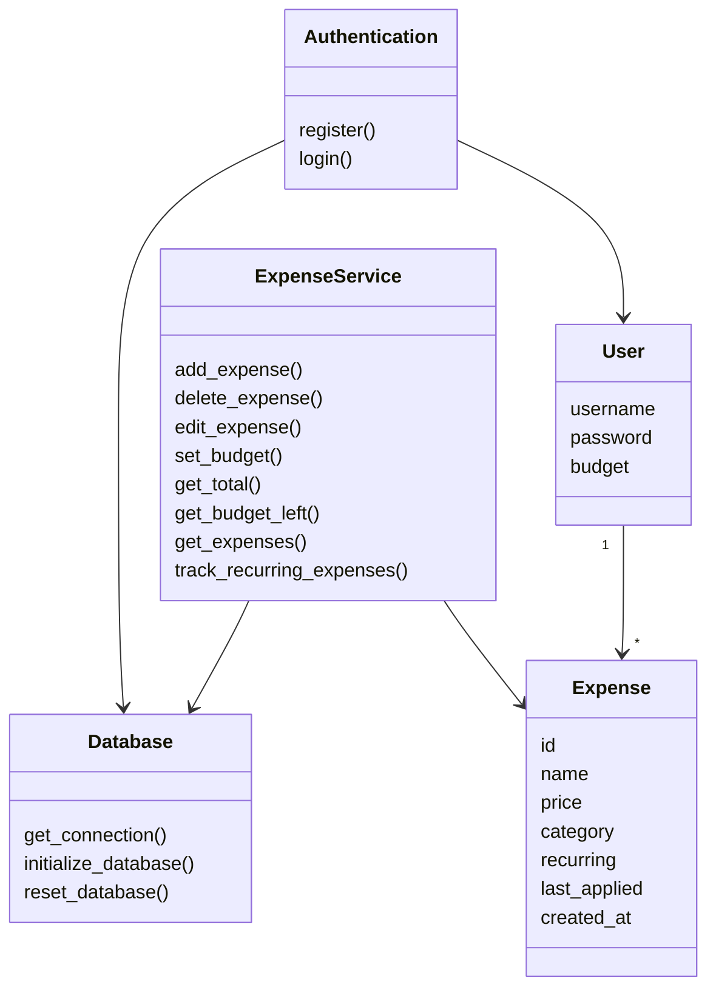
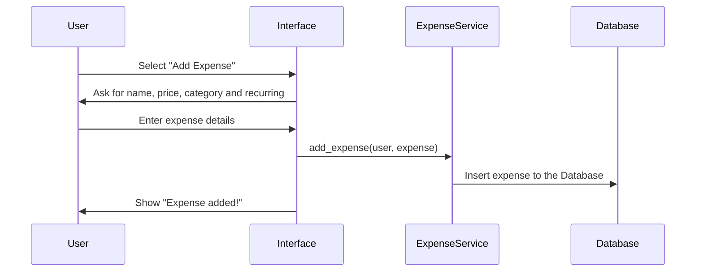
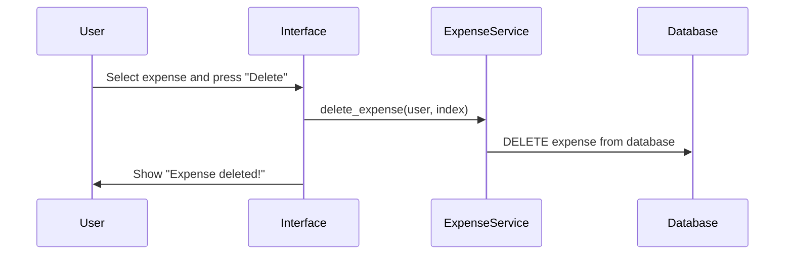
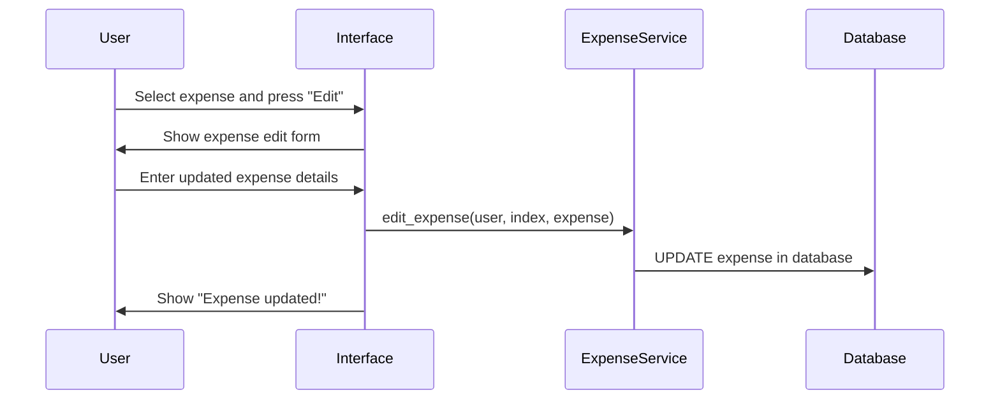

# Architecture Description

The architecture follows a layered structure where responsibilities are divided between the user interface, application logic, and data storage.

The main components of the application are:
- User interface (`index.py`)
- Application logic (`services/`)
- Database layer (`database.py` and `schema.sql`)
- Entities (`entities.py`)

## Structure

## Database and Persistent storage

The apllication uses an SQLite database for  data storage. The database stores users and expenses permanently so that data remains between the users sessions. The Database contains two different tables which are the `users` table and the `expenses` table. 

The users table stores information realted to the accounts. Each user has a unique id and username, the user can choose their password and their monthly budget that are both stored in the `users` table.

The `expenses` table stores all expense data created by users. Each expense contains:

- an expense id
- the id of the expense creator
- expense name
- price
- category
- recurring status
- the date when the recurring expense was last applied
- the creation timestamp of the expense

The user_id field in the expenses table acts as a foreign key that connects expenses to a specific user.

## Application Logic

the application logic is mainly implemented in the service layer:

### Authentication
- Handles user registration and login
- Validates input and communicates with the database
### ExpenseService
- Adds, edits, and deletes expenses
- Calculates total expenses and remaining budget
- Handles recurring expense logic

The services interact directly with the database layer to store and retrieve data.

## Adding an expense

    1. User Selects the "Add Expense" Option
    2. The interface asks for expense details
    3. The user enters the required information
    4. The interface calls the ExpenseService
    5. The expense is processed and stored in the database
    6. The user receives confirmation that adding an expense was successful

### Deleting an expense

    1. User selects an expense from the expense table.
    2. User presses the "Delete Selected" button in the interface.
    3. The interface calls the ExpenseService delete method.
    4. ExpenseService removes the selected expense from the database.
    5. The interface refreshes the expense list and shows a confirmation message to the user.

### Editing an expense

    1.  User selects an expense from the expense table.
    2.  User presses the "Edit Selected" button in the interface.
    3.  The interface opens an edit form containing the current expenses information.
    4.  User enter the updated expense information.
    5.  ExpenseService updates the expense in the database.
    6.  The interface refreshes the expense list and shows a confirmation message to the user.

## Weaknesess in The apllication

- The recurring expense system has a simplified month calculation based on 30 day intervals. This means that recurring expenses may not always match real calendar months perfectly.

- The Database does not store passwords hashed leaving a security vulnerability in the application
