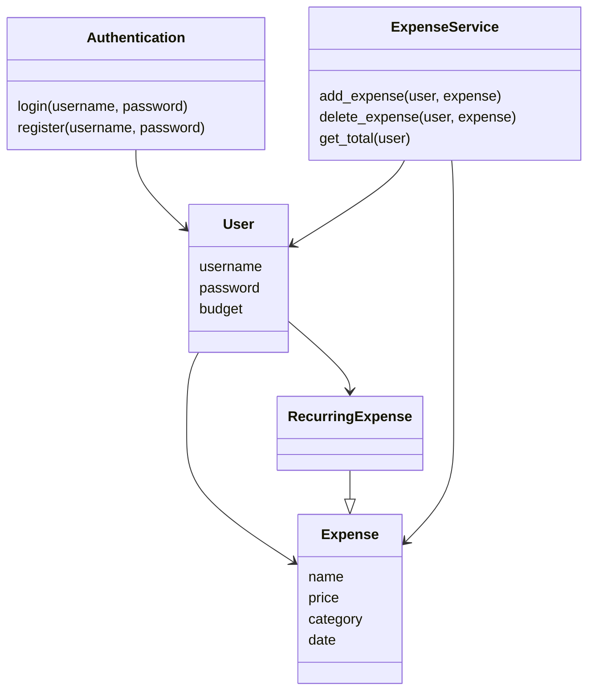

```mermaid
classDiagram

class User {
    username
    password
    budget}

class Expense {
    name
    price
    category
    date}

class RecurringExpense

class Authentication {
    login(username, password)
    register(username, password)}

class ExpenseService {
    add_expense(user, expense)
    delete_expense(user, expense)
    get_total(user)}

User --> Expense
User --> RecurringExpense
RecurringExpense --|> Expense
Authentication --> User
ExpenseService --> User
ExpenseService --> Expense
```