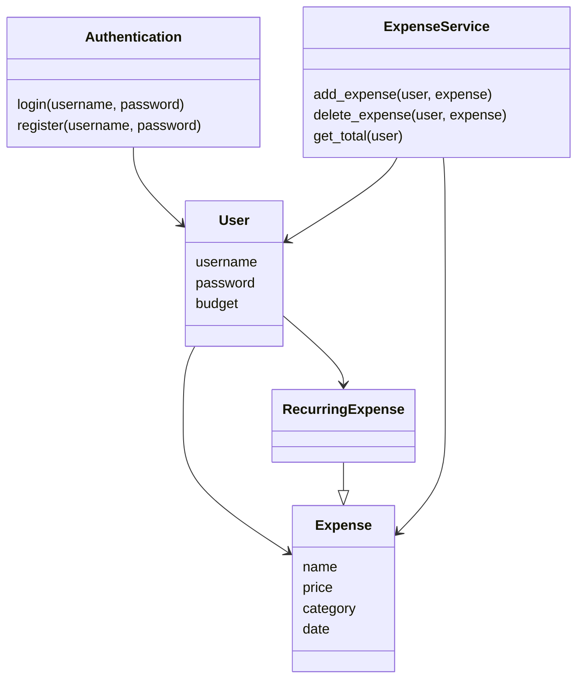
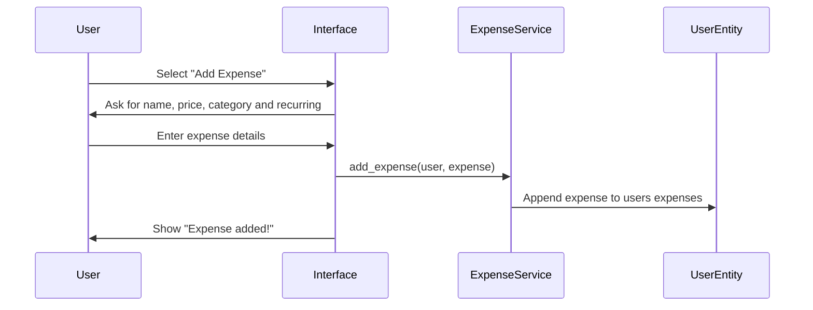

# Architecture Description

The architecture follows a layered structure where responsibilities are divided between the user interface, application logic, and data storage.

The main components of the application are:
- User interface (`index.py`)
- Application logic (`services/`)
- Database layer (`database.py` and `schema.sql`)
- Entities (`entities.py`)

## Structure

## Application Logic

the application logic is mainly implemented in the service layer:

### Authentication
- Handles user registration and login
- Validates input and communicates with the database
### ExpenseService
- Adds, edits, and deletes expenses
- Calculates total expenses and remaining budget
- Handles recurring expense logic

The services interact directly with the database layer to store and retrieve data.

## Adding an expense

    1. User Selects the "Add Expense" Option
    2. The interface asks for expense details
    3. The user enters the required information
    4. The interface calls the ExpenseService
    5. The expense is processed and stored in the database
    6. The user receives confirmation that adding an expense was successful

