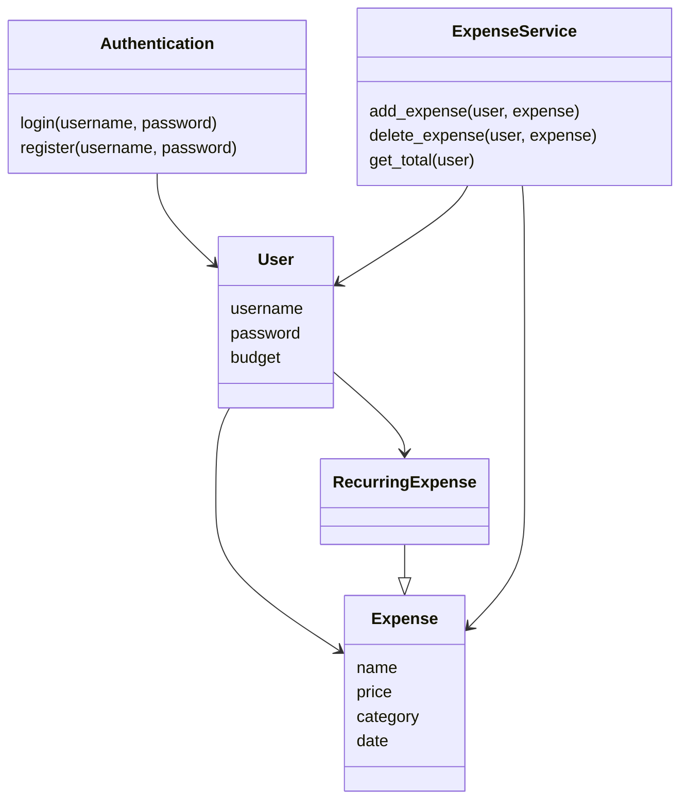
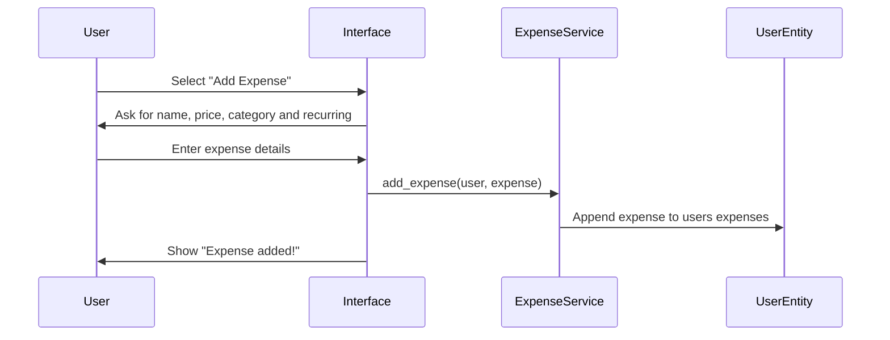

```mermaid
classDiagram

class User {
    username
    password
    budget}

class Expense {
    name
    price
    category
    date}

class RecurringExpense

class Authentication {
    login(username, password)
    register(username, password)}

class ExpenseService {
    add_expense(user, expense)
    delete_expense(user, expense)
    get_total(user)}

User --> Expense
User --> RecurringExpense
RecurringExpense --|> Expense
Authentication --> User
ExpenseService --> User
ExpenseService --> Expense
```

## Adding an expense

```mermaid
sequenceDiagram
    participant User
    participant Interface
    participant ExpenseService
    participant UserEntity

    User->>Interface: Select "Add Expense"
    Interface->>User: Ask for name, price, category and recurring
    User->>Interface: Enter expense details
    Interface->>ExpenseService: add_expense(user, expense)
    ExpenseService->>UserEntity: Append expense to users expenses
    Interface->>User: Show "Expense added!"
```
