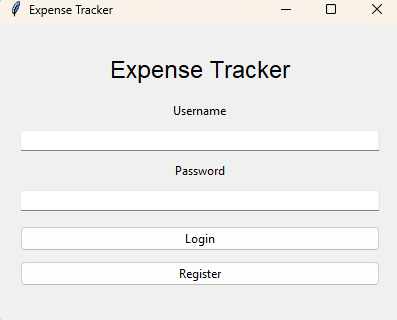
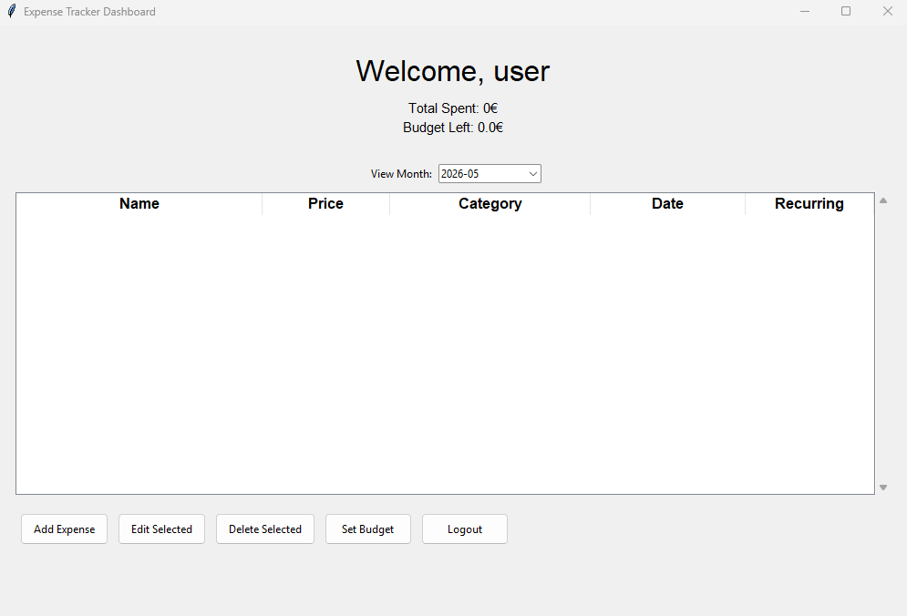
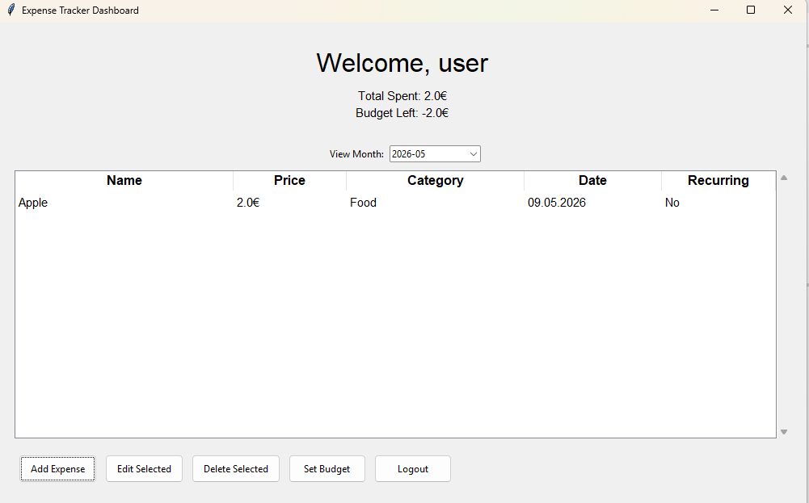
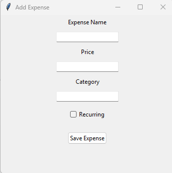
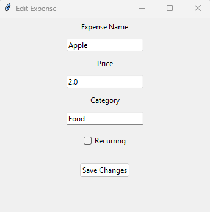
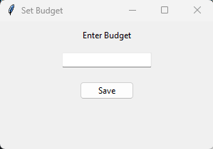

# Usage Instructions

## Starting the Application

First install the apllication dependencies with:
```bash
poetry install
```

Run the application with:

```bash
poetry run invoke start
```

---

## Register

1. Open the application  
2. Enter a username and password  
3. Press the **Register** button  

Requirements:
- Username must be at least 3 characters long
- Password must be at least 3 characters long

---

## Login

1. Enter your username and password  
2. Press the **Login** button  

If login is successful:
- the dashboard opens
- the user can manage expenses and budgets


---

# Dashboard

The dashboard contains:
- an expenses table
- monthly budget information
- expense management buttons
- a month selector for viewing archived expenses (Past months that are empty will not be visible)

The dashboard displays
- total spent during the selected month
- remaining budget
- all expenses for the selected month



---

## Viewing Expenses

The expense table displays:
- expense name
- price
- category
- creation date
- recurring status


---

## Add Expense

1. Press the **Add Expense** button  
2. Enter:
   - expense name
   - price
   - category
   - recurring status  
3. Press **Save Expense**

The expense is than displayed in the expense table.



---

## Edit Expense

1. Select an expense from the table  
2. Press the **Edit Selected** button  
3. Modify the expense information  
4. Press **Save Changes**



---

## Delete Expense

1. Select an expense from the table  
2. Press the **Delete Selected** button  

---

## Set Budget

1. Press the **Set Budget** button  
2. Enter the desired monthly budget  
3. Press **Save**



---

## Recurring Expenses

- Recuring expenses are automatically tracked  
- Approximately every 30 days:
  - a new expense entry is automatically created
  - the recurring expense is applied again for the new month

---

## Monthly Expense Archive

The application stores all previous expenses in the database.

Using the month selector, the user can:
- browse previous months
- view archived expenses
- compare monthly spending

---

## Logout/Exit

Press the **Logout** button to close the current session and exit the application.