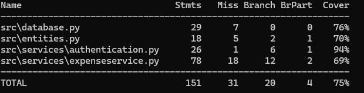

# Testing Documentation

## Unit Testing

The tests mainly focus on the application logic and between the service layer, entity objects and the database. A seperate test database is used during testing.
## System testing

System testing was performed manually through the user interface. The application was tested by using the main functionality through the user interface and verifying that the application behaves correctly.

## Test Coverage

The current tests do not fully cover:
- recurring expense tracking
- monthly archive filtering
- invalid budget and expense inputs

## Quality Issues

- The recurring expense system has a simplified month calculation based on 30 day intervals. This means that recurring expenses may not always match real calendar months perfectly.

- The Database does not store passwords hashed leaving a security vulnerability in the application.