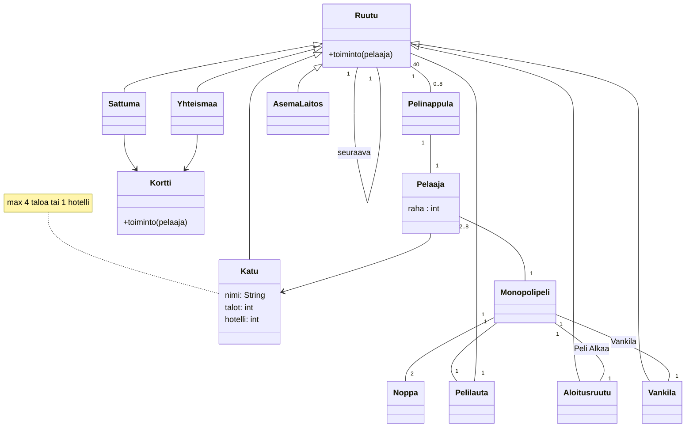

```mermaid
 classDiagram
    class Ruutu {
        +toiminto(pelaaja)}
    class Katu {
        nimi: String
        talot: int
        hotelli: int}
    note for Katu "max 4 taloa tai 1 hotelli"
    class Pelaaja {
        raha : int}
    class Kortti {
        +toiminto(pelaaja)
    }

    Monopolipeli "1" -- "2" Noppa
    Monopolipeli "1" -- "1" Pelilauta
    Pelilauta "1" -- "40" Ruutu
    Ruutu "1" -- "1" Ruutu : seuraava
    Ruutu "1" -- "0..8" Pelinappula
    Pelinappula "1" -- "1" Pelaaja
    Pelaaja "2..8" -- "1" Monopolipeli
    Ruutu <|-- Aloitusruutu
    Ruutu <|-- Vankila
    Ruutu <|-- Sattuma
    Ruutu <|-- Yhteismaa
    Ruutu <|-- AsemaLaitos
    Ruutu <|-- Katu
    Sattuma --> Kortti
    Yhteismaa --> Kortti
    Monopolipeli "1" -- "1" Aloitusruutu : Peli Alkaa
    Monopolipeli "1" -- "1" Vankila : Vankila
    Pelaaja --> Katu


```