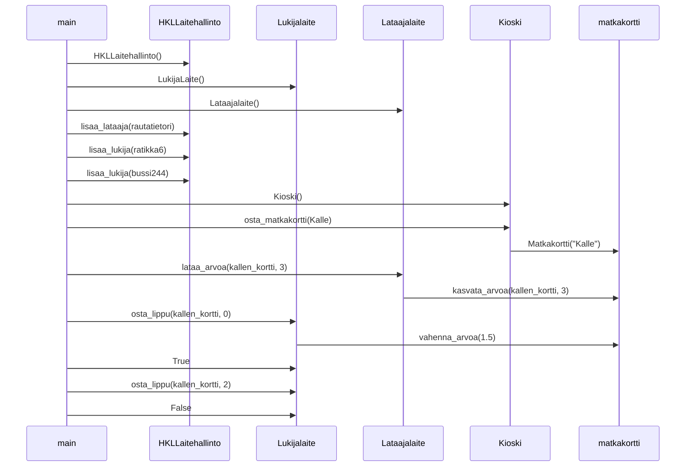

```mermaid
sequenceDiagram
    participant main

    participant HKLLaitehallinto
    main ->> HKLLaitehallinto : HKLLaitehallinto()
    participant Lukijalaite
    main ->> Lukijalaite : LukijaLaite()
    participant Lataajalaite
    main ->> Lataajalaite : Lataajalaite()

    main ->> HKLLaitehallinto : lisaa_lataaja(rautatietori)
    main ->> HKLLaitehallinto : lisaa_lukija(ratikka6)
    main ->> HKLLaitehallinto : lisaa_lukija(bussi244)
    
    participant Kioski
    main ->> Kioski : Kioski()
    main ->> Kioski: osta_matkakortti(Kalle)
    participant matkakortti
    Kioski ->> matkakortti: Matkakortti("Kalle")
    main ->> Lataajalaite: lataa_arvoa(kallen_kortti, 3)
    Lataajalaite ->> matkakortti: kasvata_arvoa(kallen_kortti, 3)
    main ->> Lukijalaite: osta_lippu(kallen_kortti, 0)
    Lukijalaite ->> matkakortti: vahenna_arvoa(1.5)
    main ->> Lukijalaite: True
    main ->> Lukijalaite: osta_lippu(kallen_kortti, 2)
    main ->> Lukijalaite: False
    

```